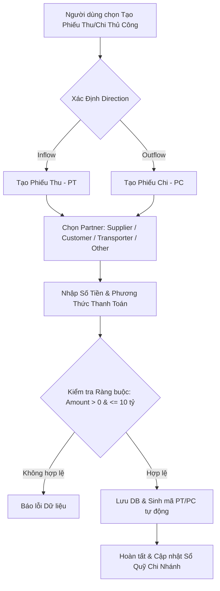

# Tài Liệu Nghiệp Vụ Phiếu Thu Chi Tự Tạo Thủ Công (Manual CashFlow Controller)

**Controller Class:** `CashFlowController.cs`  
**Route Base:** `/api/cashflow`  
**Đối tượng quản lý:** Thực thể `CashFlow` (Sổ Quỹ Chi Nhánh), `Partner`

---

## 1. Mục Đích Nghiệp Vụ

Ngoài các phiếu Thu/Chi tự động phát sinh từ việc chốt chứng từ kho (`Import`, `Return`, `Sale`, `CustomerReturn`), hệ thống cho phép người dùng **tự tạo phiếu Thu Chi thủ công (Manual CashFlow)**.

Các phiếu tự tạo này phục vụ quản lý dòng tiền linh hoạt:
- Chi trả trực tiếp cho Nhà cung cấp, Đơn vị vận chuyển, Khách hàng hoặc Cá nhân đối tác ngoài (`PartnerType.Other`).
- Ghi nhận các khoản chi phí vận hành chi nhánh (Điện, nước, internet, mặt bằng, lương nhân viên, mua sắm công cụ lẻ).
- Ghi nhận các khoản thu ngoài bán hàng (Thu hoàn tiền, Thu tiền phạt đặt cọc, Thu hồi thanh lý tài sản).

---

## 2. Quy Định Phân Loại Phiếu Thu / Phiếu Chi (CashFlow Direction)

Khi khởi tạo một phiếu CashFlow thủ công, người dùng **BẮT BUỘC** phải xác định rõ loại phiếu và hướng dòng tiền:

### 2.1. Phiếu Thu (`Direction = Inflow` / Giá trị enum = 1)
- **Ký hiệu mã phiếu:** Tự động sinh tiền tố **`PT`** + 6 chữ số (Ví dụ: `PT000123`).
- **Nghiệp vụ áp dụng:** Dòng tiền đi vào sổ quỹ chi nhánh.
  - Thu tiền nợ từ Khách hàng (`PartnerType.Customer`).
  - Thu tiền hoàn/bồi thường từ Đơn vị vận chuyển (`PartnerType.Transporter`).
  - Thu tiền từ 1 cá nhân hoặc đối tác khác (`PartnerType.Other`).
  - Thu hoàn ứng của nhân viên.

### 2.2. Phiếu Chi (`Direction = Outflow` / Giá trị enum = 2)
- **Ký hiệu mã phiếu:** Tự động sinh tiền tố **`PC`** + 6 chữ số (Ví dụ: `PC000456`).
- **Nghiệp vụ áp dụng:** Dòng tiền đi ra khỏi sổ quỹ chi nhánh.
  - Chi trả trực tiếp công nợ cho Nhà cung cấp (`PartnerType.Supplier`).
  - Chi trả cước phí cho Đơn vị vận chuyển (`PartnerType.Transporter`).
  - Chi trả tiền hàng/dịch vụ trực tiếp cho 1 cá nhân thuộc nhóm Đối tác khác (`PartnerType.Other`).
  - Chi trả chi phí vận hành, điện nước, sửa chữa chi nhánh.

---

## 3. Quản Lý Đối Tượng Thụ Hưởng / Chi Trả (Partner & Individual Entity)

Khi người dùng tự tạo phiếu CashFlow, hệ thống hỗ trợ chỉ định linh hoạt đối tượng nhận/nộp tiền:

1. **Thanh toán cho Partner đã đăng ký:**
   - Chọn `PartnerId` từ danh sách Partner hiện có (`Supplier`, `Customer`, `Transporter`).
   - Phiếu CashFlow sẽ tự động hạch toán vào lịch sử giao dịch và công nợ của Partner đó.

2. **Thanh toán cho Cá nhân / Đối tác Khác (`PartnerType.Other`):**
   - Chọn đối tác thuộc loại `PartnerType.Other` (Dành cho cá nhân bán lẻ, nhà cung cấp dịch vụ ngoài, shipper tự do, nhân viên nội bộ...).
   - Trường hợp cá nhân chưa có trong danh mục, hệ thống hỗ trợ tạo nhanh đối tác loại `Other` và ghi nhận chi tiết tên cá nhân/lý do vào thuộc tính `Note`.

---

## 4. Ràng Buộc Dữ Liệu Đầu Vào (Validation Constraints)

Để tạo phiếu CashFlow thủ công thành công, các trường dữ liệu bắt buộc tuân thủ:

| Trường Dữ Liệu | Loại Dữ Liệu | Ràng Buộc Nghiệp Vụ |
| :--- | :--- | :--- |
| **`BranchId`** | `long` | Bắt buộc. Phải là chi nhánh người dùng đang làm việc. |
| **`Direction`** | `enum` | Bắt buộc. Chỉ nhận `Inflow` (1 - Phiếu Thu) hoặc `Outflow` (2 - Phiếu Chi). |
| **`PartnerId`** | `long?` | Tùy chọn. ID của Partner (`Supplier`, `Customer`, `Transporter`, `Other`). |
| **`TotalAmount`** | `decimal` | Bắt buộc. $0 < \text{TotalAmount} \le 10,000,000,000$ VNĐ (Tối đa 10 tỷ VNĐ). |
| **`PaymentMethod`** | `enum` | Bắt buộc. `1`: Tiền mặt (Cash), `2`: Thẻ (Card), `3`: Chuyển khoản (Transfer). |
| **`Type`** | `enum` | Bắt buộc. Phân loại chi tiết (`Payment`, `Refund`, `Advance`, `Deduction`). |
| **`Note`** | `string?` | Khuyên dùng. Diễn giải chi tiết lý do thu/chi hoặc thông tin cá nhân thụ hưởng. |
| **`BusinessDate`** | `DateTime` | Bắt buộc. Ngày ghi nhận nghiệp vụ thu chi (Mặc định `DateTime.UtcNow`). |

---

## 5. Quy Trình Khởi Tạo & Hủy Phiếu CashFlow Thủ Công

