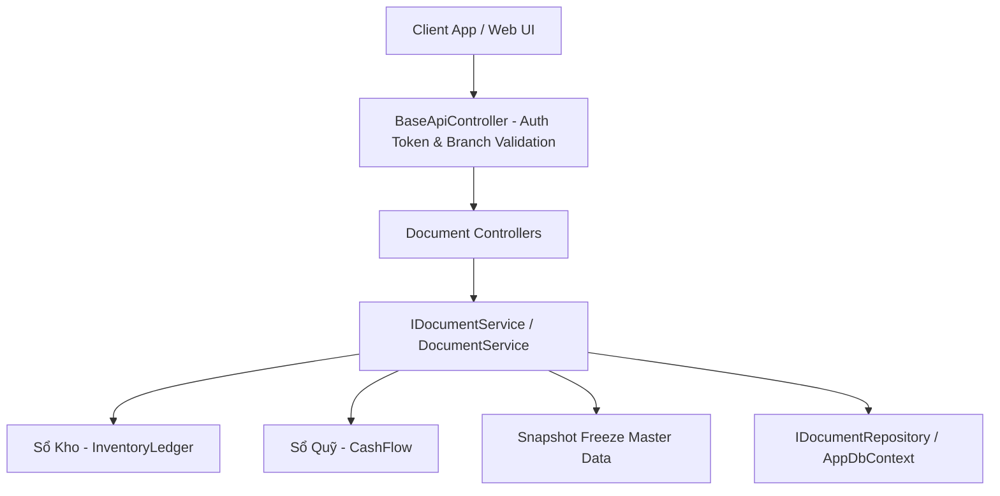

# Document Controllers Documentation — MenuGo Backend (MenuGoBE)

Thư mục này chứa tài liệu chi tiết về **nghiệp vụ (Business Logic)** và các **ràng buộc (Constraints)** của toàn bộ các **Document Controller** thuộc Module Quản lý Chứng từ (Document Management) và Sổ quỹ (Cash Flow) trong hệ thống **MenuGoBE**.

---

## Danh Mục Tài Liệu Chứng Từ

| STT | File Tài Liệu | Controller Tương Ứng | Loại Chứng Từ (DocumentType) | Mô Tả Tóm Tắt |
| :---: | :--- | :--- | :--- | :--- |
| **00** | [00_TongQuan_DocumentSystem.md](./00_TongQuan_DocumentSystem.md) | `DocumentController.cs` | Generic / System Wide | Tổng quan kiến trúc Module Document, vòng đời trạng thái, quy tắc làm tròn, đóng băng snapshot & ràng buộc chung |
| **01** | [01_ImportDocumentController.md](./01_ImportDocumentController.md) | `ImportDocumentController.cs` | `Import` (1) | Chứng từ Nhập kho từ Nhà cung cấp, cập nhật giá vốn bình quân (WMA) & công nợ |
| **02** | [02_ExportDocumentController.md](./02_ExportDocumentController.md) | `ExportDocumentController.cs` | `Export` (2) | Chứng từ Xuất dùng nội bộ (tiêu hao nguyên vật liệu, phụ liệu chi nhánh) |
| **03** | [03_TransferDocumentController.md](./03_TransferDocumentController.md) | `TransferDocumentController.cs` | `Transfer` (3) | Chứng từ Chuyển kho liên chi nhánh (Quy trình 2 bước: Gửi & Nhận/Từ chối) |
| **04** | [04_CheckDocumentController.md](./04_CheckDocumentController.md) | `CheckDocumentController.cs` | `Check` (4) | Chứng từ Kiểm kho (đối soát tồn thực tế với tồn hệ thống, ghi nhận lệch) |
| **05** | [05_CostAdjustmentDocumentController.md](./05_CostAdjustmentDocumentController.md) | `CostAdjustmentDocumentController.cs` | `CostAdjustment` (5) | Chứng từ Điều chỉnh giá vốn bình quân cho mặt hàng tồn kho |
| **06** | [06_ExportDeleteDocumentController.md](./06_ExportDeleteDocumentController.md) | `ExportDeleteDocumentController.cs` | `ExportDelete` (6) | Chứng từ Xuất hủy (hàng hỏng, hết hạn, hư hại) |
| **07** | [07_ProductionDocumentController.md](./07_ProductionDocumentController.md) | `ProductionDocumentController.cs` | `Production` (7) | Chứng từ Sản xuất / Chế biến (Trừ nguyên liệu FatherId, tạo Thành phẩm) |
| **08** | [08_ReturnDocumentController.md](./08_ReturnDocumentController.md) | `ReturnDocumentController.cs` | `Return` (8) | Chứng từ Trả hàng Nhà cung cấp (Bắt buộc gắn với phiếu Import đã Completed) |
| **09** | [09_CustomerReturnDocumentController.md](./09_CustomerReturnDocumentController.md) | `CustomerReturnDocumentController.cs` | `CustomerReturn` (9) | Chứng từ Khách trả hàng (Bắt buộc gắn với phiếu Sale đã Completed) |
| **10** | [10_SaleDocumentController.md](./10_SaleDocumentController.md) | `SaleDocumentController.cs` | `Sale` (10) | Chứng từ Xuất bán hàng (Chỉ hỗ trợ chốt trực tiếp Completed, trừ kho & tạo doanh thu) |
| **11** | [11_CashFlowController.md](./11_CashFlowController.md) | `CashFlowController.cs` | CashFlow / Sổ quỹ | Quản lý phiếu Thu (PT - Inflow) và phiếu Chi (PC - Outflow) thủ công & tự động |
| **12** | [12_ImportReturnCashFlow.md](./12_ImportReturnCashFlow.md) | `ImportDocumentController.cs`, `ReturnDocumentController.cs` | Integration | Mô tả tích hợp CashFlow với phiếu Nhập kho (`Import`) & Trả hàng NCC (`Return`), kiểm soát hạn mức thanh toán lũy kế |
| **13** | [13_ManualCashFlowController.md](./13_ManualCashFlowController.md) | `CashFlowController.cs` | Manual CashFlow | Mô tả phiếu Thu/Chi tự tạo thủ công cho Partner hoặc Cá nhân đối tác ngoài (`PartnerType.Other`), số tiền, PTTT & hướng dòng tiền |
| **14** | [14_PartnerSupplierCashFlowManagement.md](./14_PartnerSupplierCashFlowManagement.md) | `PartnerController.cs`, `CashFlowController.cs` | Partner & Debt | Quản lý nợ & dòng tiền Supplier, và bổ sung màn hình/UI theo dõi dòng tiền chi trả cho các Partner không phải NCC (`Transporter`, `Other`, `Customer`) |

---

## Kiến Trúc Tổng Quan

